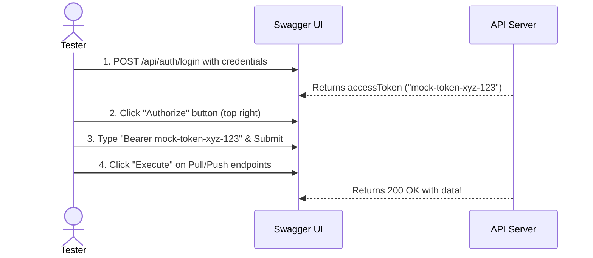

# API Endpoint Testing & Swagger Authorization Guide

This guide explains why you received a `401 Unauthorized` error in Swagger UI and provides step-by-step instructions to authenticate and test all system endpoints.

---

## 1. Why you received a 401 Unauthorized
In your screenshot, the executed `curl` command was:
```bash
curl -X 'GET' \
  'https://localhost:5001/api/sync/pull?tableName=JAN_WO_ORDERS_TEST&cursor=0&limit=100' \
  -H 'accept: */*'
```
Because the `SyncController` is protected with the `[Authorize]` attribute, the server expects an **`Authorization`** header containing a valid bearer token. Since no token header was sent, the server rejected it.

---

## 2. Step-by-Step Swagger Authorization

To authorize and run endpoints, follow this sequence:



1. **Get a Token:**
   - Expand the **`POST /api/auth/login`** endpoint in Swagger.
   - Click **Try it out**.
   - Paste the following payload and click **Execute**:
     ```json
     {
       "tenantId": "TENANT_A",
       "username": "admin",
       "password": "admin123"
     }
     ```
   - Copy the value of the `accessToken` from the response (e.g. `mock-token-xyz-123`).

2. **Authenticate Swagger:**
   - Scroll to the top of the Swagger page and click the **Authorize 🔓** button.
   - In the input field, type:
     ```text
     Bearer mock-token-xyz-123
     ```
     *(Make sure there is a space between `Bearer` and the token).*
   - Click **Authorize** then **Close**. The lock icons on the endpoints will turn closed 🔒.

3. **Re-Test Pull:**
   - Expand `GET /api/sync/pull`, click **Try it out**, enter `JAN_WO_ORDERS_TEST`, and click **Execute**. It will now return `200 OK`!

---

## 3. Reference Payload Testing Guide

Use these payloads to test endpoints once authorized:

### 1. GET `/api/sync/pull` (Fetch changes / Initial Sync)
* **Type:** Query parameters
* **Parameters:**
  * `tableName`: `JAN_WO_ORDERS_TEST`
  * `cursor`: `0`
  * `limit`: `100`
* **Response (Initial Sync Bootstrap):**
  ```json
  {
    "changes": [
      {
        "serverCursor": 1,
        "rowPk": "1",
        "changeType": "created",
        "record": {
          "ID": 1,
          "WO_CODE": "WO-2026-001",
          "DESCRIPTION": "Quarterly compressor maintenance on roof chiller",
          "ASSET_ID": "AST-101",
          "STATUS": "OPEN",
          "PRIORITY": "HIGH",
          "ASSIGNED_TO": "john.doe@company.com",
          "TENANT_CODE": "TENANT_A",
          "SCHEDULED_DATE": "2026-08-23T12:00:00Z"
        }
      }
    ],
    "nextCursor": 0,
    "hasMore": false
  }
  ```

---

### 2. POST `/api/sync/push` (Upload local changes)
* **Type:** JSON Body
* **Payload (Create New Work Order):**
  ```json
  {
    "clientId": "test-workstation-client-uuid",
    "tableName": "JAN_WO_ORDERS_TEST",
    "operations": [
      {
        "operationId": "op-create-12345",
        "rowPk": "2",
        "operationType": "create",
        "expectedVersion": null,
        "payload": {
          "WO_CODE": "WO-2026-999",
          "DESCRIPTION": "Emergency cooling fan repair",
          "ASSET_ID": "AST-101",
          "STATUS": "OPEN",
          "PRIORITY": "CRITICAL"
        }
      }
    ]
  }
  ```

* **Payload (Update Work Order Status):**
  ```json
  {
    "clientId": "test-workstation-client-uuid",
    "tableName": "JAN_WO_ORDERS_TEST",
    "operations": [
      {
        "operationId": "op-update-12346",
        "rowPk": "1",
        "operationType": "update",
        "expectedVersion": 1,
        "payload": {
          "STATUS": "IN_PROGRESS"
        }
      }
    ]
  }
  ```

* **Payload (Delete / Tombstone Work Order):**
  ```json
  {
    "clientId": "test-workstation-client-uuid",
    "tableName": "JAN_WO_ORDERS_TEST",
    "operations": [
      {
        "operationId": "op-delete-12347",
        "rowPk": "1",
        "operationType": "delete",
        "expectedVersion": 2,
        "payload": null
      }
    ]
  }
  ```

---

### 3. GET `/api/portal/manifest` (Get Sidebar Layout Config)
* **Type:** No parameters required. Returns list of navigation tabs allowed for your role.
* **Response:**
  ```json
  {
    "portalId": "dynamic-portal",
    "title": "Manufacturing Portal",
    "sections": [
      {
        "key": "work_orders",
        "label": "Work Orders",
        "icon": "clipboard-list",
        "route": "/work-orders",
        "tableName": "JAN_WO_ORDERS_TEST",
        "syncTableId": "default-oracle-conn",
        "order": 100
      }
    ]
  }
  ```
