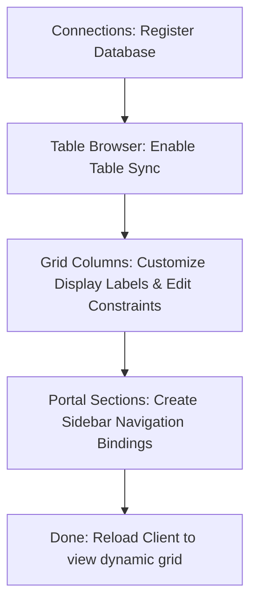

# Manufacturing Portal — Restructured Workstation Usage Guide

This guide describes how to configure, run, and test the **Offline-First Dynamic Portal** and the restructured Clean Architecture C# API solution.

---

## 1. Running the workstation

### Prerequisites
- **.NET SDK 9.0+**
- **Node.js 20+**

### Launching the Backend API
1. Navigate to the `server/` directory:
   ```bash
   cd server
   ```
2. Build the solution to restore dependencies:
   ```bash
   dotnet build Portal.sln
   ```
3. Run the API project:
   ```bash
   dotnet run --project Portal.Api/Portal.Api.csproj
   ```
   *The server initializes a local SQLite configuration database (`portal.db`) inside `Portal.Api/` and binds to `http://localhost:5000` (or the configured launch port).*

### Launching the Frontend Client
1. Navigate to the `client/` directory:
   ```bash
   cd ../client
   ```
2. Run the Vite development server:
   ```bash
   npm run dev
   ```
3. Open `http://localhost:5173` in your browser.

---

## 2. API Swagger UI

We have integrated Swagger UI to facilitate manual endpoint testing. 

- **Access URL:** `http://localhost:5000/swagger`
- **Authentication:**
  1. Post a request to `/api/auth/login` with credentials (e.g. `Username: admin`, `Password: admin123`).
  2. Copy the `accessToken` (e.g., `mock-token-xyz-123`).
  3. Click **Authorize** at the top right of the Swagger UI.
  4. Paste the token in the format `Bearer <token>` (e.g., `Bearer mock-token-xyz-123`) and click authorize. All secured routes are now accessible within the page.

---

## 3. Step-by-Step No-Code Setup

To register and render a new offline-sync business table inside the portal without changing code, follow these steps:



### Step 1: Register Connection
- Navigate to **Admin Studio -> Connections** in the portal sidebar.
- Enter a connection name (e.g., `Oracle ERP Production`).
- Enter the Connection String. 
  > [!TIP]
  > If connection provider is Oracle, the factory automatically delegates to the pre-compiled `OracleService` DLL to resolve your real network string. You can simply write `"oracle"` in the input field!
- Click **Add Connection**, then click **Test** to check connection status.

### Step 2: Enable Table Sync
- Navigate to **Admin Studio -> Table Browser**.
- Choose your connection, select the target table from the list of introspected database catalog options.
- Assign the table's Primary Key column (the app auto-detects it) and optional Tenant Column (if multi-tenant visibility controls are needed).
- Click **Enable Table Sync**.

### Step 3: Configure Column Layouts
- Navigate to **Admin Studio -> Grid Columns**.
- Pick your target table from the dropdown. All introspected fields will populate.
- Edit display headers (e.g., change `WO_CODE` to `Work Order Code`), assign data types (String, Number, Date, Boolean), toggle visibility, and mark which columns can be edited inside the cells.
- Click **Save Config Details**.

### Step 4: Map Sidebar Routing
- Navigate to **Admin Studio -> Portal Sections**.
- Match the sync table with a navigation name (e.g., `Job List`), icon (Clipboard list, Layers, Database), route path (e.g., `/jobs`), and comma-separated access roles (`admin,planner`).
- Click **Add Navigation Link** and reload the window. The new dynamic workspace will render in your menu list!

---

## 4. Manual Sync & Offline Testing

1. **Simulate Offline Mode:**
   - Open Chrome DevTools, click **Network**, and toggle the network throttle dropdown to **Offline**.
   - Navigate to your dynamic table workspace. Add, update, or delete records.
   - All operations are captured inside the client's Dexie outbox queue and stored in IndexedDB. Sync badges will mark changes as `Pending`.
2. **Resolve Conflicts:**
   - If a record version has diverged on the server (a different client edited the same row), the sync loop flags a `Conflict`.
   - The UI automatically renders conflict buttons: click **Keep Mine** to override the server, or **Keep Server** to fetch and overwrite local edits with server changes.
