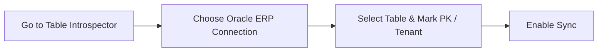

# A-Z Configuration Guide: Using JAN Test Tables in the Dynamic Portal

This step-by-step walkthrough shows you how to take your test tables (`JAN_WO_ORDERS_TEST` and `JAN_EQ_ASSETS_TEST`), register them, configure visible columns, set up sidebar menus, and manage entries using overlays/modals in the UI.

---

## Prerequisites: Database Tables Setup
Make sure the tables are created in your database and seeded with your sample business data:

```sql
-- Sample 1: Work Orders
CREATE TABLE JAN_WO_ORDERS_TEST (
    ID                  NUMBER(19)     GENERATED BY DEFAULT AS IDENTITY PRIMARY KEY,
    WO_CODE             VARCHAR2(30)   NOT NULL UNIQUE,
    DESCRIPTION         VARCHAR2(500)  NOT NULL,
    ASSET_ID            VARCHAR2(36)   NOT NULL,
    STATUS              VARCHAR2(20)   DEFAULT 'OPEN' NOT NULL,
    PRIORITY            VARCHAR2(10)   DEFAULT 'MEDIUM' NOT NULL,
    ASSIGNED_TO         VARCHAR2(100)  NULL,
    TENANT_CODE         VARCHAR2(20)   NOT NULL,
    SCHEDULED_DATE      TIMESTAMP(6)   NULL
);

-- Sample 2: Assets
CREATE TABLE JAN_EQ_ASSETS_TEST (
    ID                  NUMBER(19)     GENERATED BY DEFAULT AS IDENTITY PRIMARY KEY,
    ASSET_CODE          VARCHAR2(30)   NOT NULL UNIQUE,
    EQUIPMENT_NAME      VARCHAR2(200)  NOT NULL,
    LOCATION_CODE       VARCHAR2(50)   NOT NULL,
    IS_CRITICAL         NUMBER(1)      DEFAULT 0 NOT NULL,
    TENANT_CODE         VARCHAR2(20)   NOT NULL
);
```

---

## Step 1: Login to the Workstation
1. Start the API backend and Vite client (as detailed in `UsageGuide.md`).
2. Open `http://localhost:5173/login`.
3. Log in with:
   * **Tenant ID:** `TENANT_A`
   * **Username:** `admin`
   * **Password:** `admin123`

---

## Step 2: Enable Offline Sync for the Tables
We will now enable synchronization mapping for your tables.



### For Work Orders:
1. Navigate to **Admin Studio -> Table Introspector** in the sidebar.
2. Select **Connection Source**: `Oracle ERP (Default)` (the system auto-resolves this via `OracleService`).
3. Under **Select Schema Table**, type `JAN_WO` in the search filter bar.
4. Select `JAN_WO_ORDERS_TEST` from the dropdown list.
5. In the fields that appear:
   * **Primary Key Column:** Select `ID`
   * **Tenant Column:** Select `TENANT_CODE`
6. Click **Enable Table Sync**.

### For Assets:
1. Repeat the steps above.
2. Search and select `JAN_EQ_ASSETS_TEST` under schema tables.
3. Mark `ID` as **Primary Key Column** and `TENANT_CODE` as **Tenant Column**.
4. Click **Enable Table Sync**.

---

## Step 3: Column Configuration (Select 6 out of 10)
Your work orders table has 9 columns. We will configure it to show only **6 columns** on the grid.

1. Navigate to **Admin Studio -> Column Grid Editor**.
2. Pick `JAN_WO_ORDERS_TEST` using the search filter.
3. You will see a table displaying all 9 columns. Configure them as follows:

| Column Name | Display Label | Visible (Checkbox) | Editable (Checkbox) | Data Type |
| :--- | :--- | :---: | :---: | :--- |
| **ID** | `ID` | ❌ (Uncheck) | ❌ (Uncheck) | `number` |
| **WO_CODE** | `Work Order Code` |  (Check) |  (Check) | `string` |
| **DESCRIPTION** | `Description` |  (Check) |  (Check) | `string` |
| **ASSET_ID** | `Asset ID` |  (Check) |  (Check) | `string` |
| **STATUS** | `Status` |  (Check) |  (Check) | `string` |
| **PRIORITY** | `Priority` |  (Check) |  (Check) | `string` |
| **ASSIGNED_TO** | `Assigned To` | ❌ (Uncheck) | ❌ (Uncheck) | `string` |
| **TENANT_CODE** | `Tenant Code` | ❌ (Uncheck) | ❌ (Uncheck) | `string` |
| **SCHEDULED_DATE**| `Scheduled Date` |  (Check) |  (Check) | `date` |

4. Click **Save Config Details** at the bottom.
   > [!NOTE]
   > By unchecking `ID`, `ASSIGNED_TO`, and `TENANT_CODE` from **Visible**, you selected exactly **6 columns** to display on your workspace grid.

5. Select `JAN_EQ_ASSETS_TEST` and customize its grid layout (e.g. unchecking `ID` and `TENANT_CODE` to display only 4 columns). Click **Save**.

---

## Step 4: Map Sidebar Navigation Buttons
We will now add navigation items to show the tables on the main sidebar menu.

1. Navigate to **Admin Studio -> Portal Section Bindings**.
2. **For Work Orders:**
   * **Target Sync Table:** Select `JAN_WO_ORDERS_TEST` (use the filter search box to locate it).
   * **Section Key:** Enter `work_orders`
   * **Label:** Enter `Work Orders`
   * **Icon:** Select `clipboard-list`
   * **Route:** Enter `/work-orders`
   * **Access Roles:** `admin,planner,supervisor`
   * Click **Add Navigation Link**.
3. **For Assets:**
   * **Target Sync Table:** Select `JAN_EQ_ASSETS_TEST`
   * **Section Key:** Enter `assets`
   * **Label:** Enter `Asset Registry`
   * **Icon:** Select `layers`
   * **Route:** Enter `/assets`
   * **Access Roles:** `admin,planner,supervisor`
   * Click **Add Navigation Link**.

---

## Step 5: View and Manage Records (Modals & Actions)
1. **Reload your browser window.**
2. Notice that the sidebar now displays **Work Orders** and **Asset Registry**!

### Adding an Entry (Add Record Modal):
1. Click **Work Orders** in the sidebar.
2. The dynamic AG Grid displays the **6 columns** you selected in Step 3!
3. Click the **New Entry** button at the top right.
4. A beautiful, centered glassmorphic **Add Record Modal** opens on top of the screen.
5. Enter the values (e.g., `WO_CODE: WO-2026-003`, `DESCRIPTION: Repair HVAC fan`, `ASSET_ID: AST-101`, `STATUS: OPEN`, `PRIORITY: HIGH`) and click **Save Record**. The modal closes and the row renders instantly on the grid!

### Editing an Entry (Edit Record Modal):
1. Locate any record in the grid.
2. In the **Actions** column on the right, click the **Edit** action button (pencil icon).
3. The glassmorphic **Edit Record Modal** opens containing the values.
4. Modify the values (e.g., change `Status` from `OPEN` to `IN PROGRESS`) and click **Save Record**. The modal closes and the record updates.

### Offline Sync Test:
1. Pull up Chrome DevTools, click **Network**, and choose **Offline**.
2. Click the **Edit** button for a record, change its priority, and click **Save Record**.
3. The record is updated instantly locally in your workstation's IndexedDB. The **Sync Status** column displays a yellow `Pending` badge.
4. Set the network back to **Online**. The sync loop triggers, updating the server database automatically, and changing the badge back to a green `Synced` badge!
